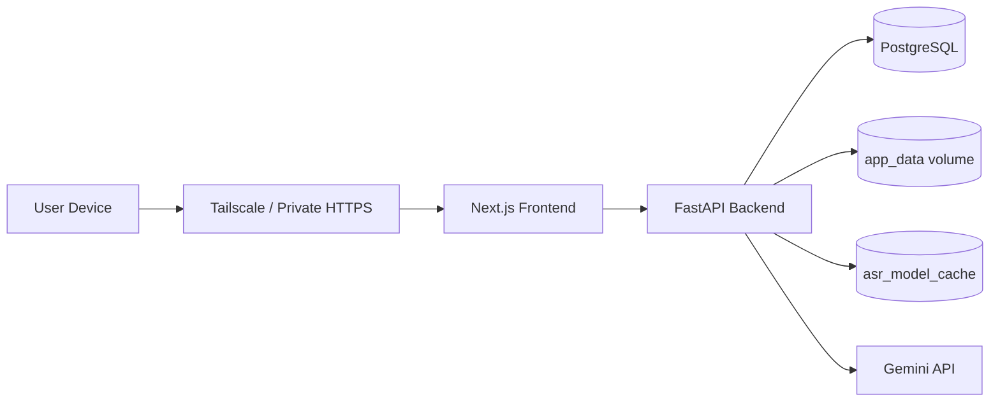
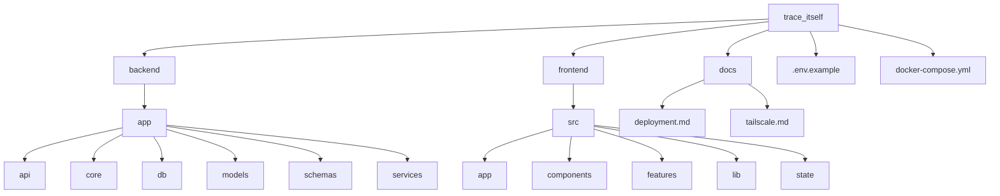
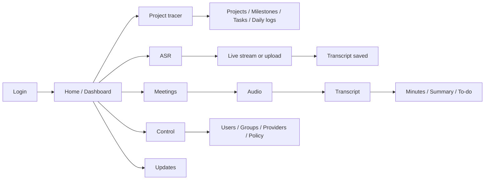
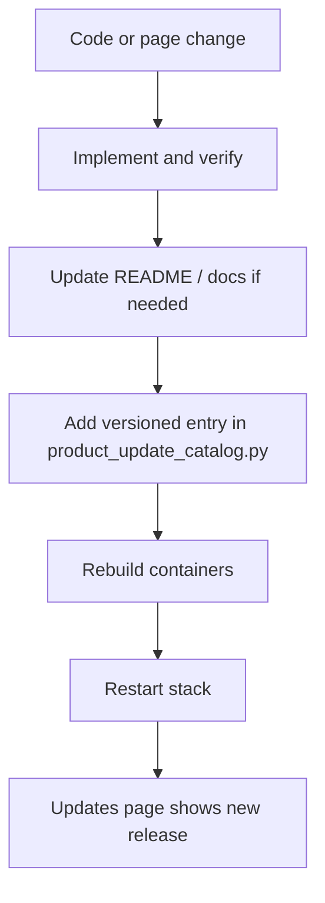

# trace_itself

`trace_itself` is a private, self-hosted execution dashboard for long-horizon learning and project management. It stays intentionally narrow, but it now supports multiple private user accounts with isolated data.

Maintained by Jason Chia-Sheng Lin, PhD student at Institute of Biophotonics, NYCU. Feel free to contact me.

It now has two main user-facing functions:

- Progress tracking for projects, milestones, tasks, and daily logs
- Private audio workflows: ASR transcripts and meeting notes per user

## MVP scope

- Multi-user account login with per-user private data
- Admin-managed user accounts and password resets
- Admin control panel for access groups, provider storage, and feature permissions
- Temporary account lockout after repeated failed login attempts
- Projects, milestones, tasks, and daily logs
- Private ASR with live streaming, saved audio, and per-user transcript history
- Meeting records with transcript, minutes, summary, and action items
- Shared product updates log for fixes, builds, and release notes
- Dashboard for active work, today tasks, overdue tasks, upcoming milestones, recent logs, and lightweight progress visuals
- FastAPI backend with PostgreSQL
- Next.js frontend with App Router
- Docker Compose deployment with localhost-only exposure by default
- Tailscale-first private remote access tutorial for lab-server deployment

## Architecture

- Frontend: Next.js + React
- Backend: FastAPI + SQLAlchemy
- Database: PostgreSQL 16
- ASR engine: local Breeze ASR 25 via faster-whisper with rolling live-stream decode
- Meeting summarizer: Gemini 3.1 Flash-Lite API
- Auth: username/password login with hashed passwords, signed session cookies, and temporary lockouts
- Secrets vault: encrypted provider API key storage in Postgres
- Deployment: Docker Compose with a Next.js standalone frontend container
- Remote access: keep services local to the host and expose the frontend through a private network tool such as Tailscale

### System map



Why this shape:

- Next.js gives us file-based routing, a cleaner production runtime, and an easier path to future server-side optimization without changing the product model.
- FastAPI + SQLAlchemy gives us typed APIs and a clean data layer without extra framework weight.
- Local ASR keeps transcription on the lab machine instead of shipping audio to a third-party ASR service.
- Meeting summaries build on the saved transcript, so the raw workflow stays private-first and only the transcript text is sent to Gemini when you enable that feature.
- Postgres stays on the internal Docker network and is never published.
- The frontend and backend bind to `127.0.0.1` on the host so the default posture is private-first.

## Repo layout

```text
.
├── backend/
│   ├── app/
│   │   ├── api/
│   │   ├── core/
│   │   ├── db/
│   │   ├── models/
│   │   ├── schemas/
│   │   ├── services/
│   │   └── main.py
│   ├── Dockerfile
│   └── requirements.txt
├── docs/
│   ├── deployment.md
│   └── tailscale.md
├── frontend/
│   ├── src/
│   │   ├── app/
│   │   ├── components/
│   │   ├── features/
│   │   ├── lib/
│   │   └── state/
│   ├── Dockerfile
│   ├── next.config.mjs
│   └── package.json
├── .env.example
├── docker-compose.yml
└── README.md
```

### Repo structure map



## Quick start

1. Copy the environment file:

   ```bash
   cp .env.example .env
   ```

2. Edit `.env` and set at least:

   - `POSTGRES_PASSWORD`
   - `SECRET_KEY`
   - `CREDENTIALS_SECRET_KEY`
   - `DEFAULT_LLM_RUNS_PER_24H`
   - `DEFAULT_MAX_AUDIO_SECONDS_PER_REQUEST`
   - `INITIAL_ADMIN_USERNAME`
   - `INITIAL_ADMIN_PASSWORD`

   Optional ASR tuning:

   - `ASR_MODEL_NAME=SoybeanMilk/faster-whisper-Breeze-ASR-25`
   - `ASR_DEVICE=cuda`
   - `ASR_COMPUTE_TYPE=float16`
   - `ASR_LIVE_PARTIAL_INTERVAL_MS=1500`
   - `ASR_LIVE_COMMIT_SILENCE_MS=1200`
   - `ASR_MAX_UPLOAD_MB=512`

   Optional meeting-note setup:

   - `GEMINI_API_KEY=...`
   - `GEMINI_MODEL=gemini-3.1-flash-lite-preview`
   - `MEETING_MAX_UPLOAD_MB=512`

3. If you want local Breeze ASR to run on the NVIDIA GPU, install the NVIDIA Container Toolkit on Ubuntu first:

   ```bash
   curl -fsSL https://nvidia.github.io/libnvidia-container/gpgkey | \
     sudo gpg --dearmor -o /usr/share/keyrings/nvidia-container-toolkit-keyring.gpg
   curl -fsSL https://nvidia.github.io/libnvidia-container/stable/deb/nvidia-container-toolkit.list | \
     sed 's#deb https://#deb [signed-by=/usr/share/keyrings/nvidia-container-toolkit-keyring.gpg] https://#g' | \
     sudo tee /etc/apt/sources.list.d/nvidia-container-toolkit.list > /dev/null
   sudo apt-get update
   sudo apt-get install -y nvidia-container-toolkit
   sudo nvidia-ctk runtime configure --runtime=docker
   sudo systemctl restart docker
   ```

4. Start the stack:

   Recommended for CUDA ASR on the lab machine:

   ```bash
   docker compose -f docker-compose.yml -f docker-compose.cuda.yml up --build -d
   ```

   Temporary CPU-only fallback:

   ```bash
   docker compose up --build -d
   ```

5. Open the app locally:

   - Frontend: `http://127.0.0.1:3000`
   - Backend API: `http://127.0.0.1:8000`

6. Sign in with:

   - username from `INITIAL_ADMIN_USERNAME`
   - password from `INITIAL_ADMIN_PASSWORD`

7. If you need more accounts or need to manage feature access, sign in as the admin user and open the `Control` page.

8. Open the `Control` page as an admin when you need to:

   - create or disable user accounts
   - assign users to feature access groups
   - store ASR or LLM provider settings and API keys
   - choose which providers stay active in the app
   - tune the wallet guardrails for text runs and max audio length

The backend auto-creates the MVP tables on startup and bootstraps the initial admin account if no users exist yet.

## CUDA ASR notes

- `docker-compose.cuda.yml` is the GPU overlay for the backend.
- Breeze ASR now expects CUDA through Docker, not CPU-only inference, when `ASR_DEVICE=cuda`.
- If the NVIDIA runtime is missing, ASR and Meetings return a clear `503` instead of crashing the backend.
- `ASR_COMPUTE_TYPE=float16` is the recommended fast path.
- If you need lower VRAM use, try `ASR_COMPUTE_TYPE=int8_float16`.

## Core workflows

### Main user workflow



### Change and release workflow



Notes for the versioned updates log:

- The `Updates` page is read-only for signed-in users.
- Release entries are source-controlled in [backend/app/core/product_update_catalog.py](/home/jnln3799/every_on_git_ubuntu/trace_itself/backend/app/core/product_update_catalog.py).
- When you ship a new page or feature change, add a new catalog entry with the new date and a version label such as `v1.0.55`, then rebuild the backend.
- On startup, the backend syncs that catalog into the database so the `Updates` page and dashboard stay current.

Notes for ASR:

- The first transcription request downloads the ASR model into the Docker volume `asr_model_cache`.
- The live ASR path streams normalized mic audio in small chunks instead of waiting for a full upload.
- The browser capture path applies echo cancellation, noise suppression, adaptive loudness control, and a speech-friendly compressed recording for storage.
- Uploaded or recorded audio is stored in the Docker volume `app_data`, and transcript/meeting metadata is stored in Postgres.
- Supported upload formats include common file types such as `wav`, `mp3`, `m4a`, `ogg`, `flac`, and `webm`.
- In-browser recordings use speech-optimized compressed audio so meeting capture stays storage-friendly.
- Users only see ASR providers that match their feature permissions.
- Audio jobs follow the admin policy limit for max duration per file. The default is 5 hours.
- The first live chunk can take longer than normal if the ASR model still needs to warm the cache on the server.

Notes for meeting records:

- The `Meetings` page runs Breeze ASR locally first, then asks Gemini for minutes, a short summary, and action items.
- Meeting-note generation requires `GEMINI_API_KEY`.
- If you change ASR or Gemini settings, rebuild the backend container.
- The meeting page lets users choose from active providers they are allowed to use.
- LLM text runs follow the admin policy limit. The default is 3 runs per 24 hours per user.

Notes for the control plane:

- Feature access is grouped through admin-managed access groups such as `Full access`, `Projects only`, or `Meetings`.
- A user can only see and use pages that match their group's capabilities.
- Provider secrets are stored encrypted in the database.
- The `Control` page is admin-only.
- The `Policy` tab lets you cap text AI runs per 24 hours and max audio duration per file for all users.

## Local development

### Backend

```bash
python3 -m venv .venv
source .venv/bin/activate
pip install -r backend/requirements.txt
cd backend
uvicorn app.main:app --reload
```

Use `docker compose up -d db` if you want Postgres running in Docker while developing locally.

### Frontend

```bash
cd frontend
npm install
npm run dev
```

The Next.js dev server proxies `/api` to `API_PROXY_TARGET`. The default target in [frontend/.env.example](/home/jnln3799/every_on_git_ubuntu/trace_itself/frontend/.env.example) is `http://127.0.0.1:8000`.

## Updating a running Docker stack

`docker compose logs -f frontend` and `docker compose logs -f backend` only show logs. They do not rebuild or restart anything.

Use these commands when you change code:

- Frontend only:

  ```bash
  docker compose up --build -d frontend
  ```

  Then refresh the browser. If the old UI still appears, do a hard refresh.

- Backend only:

  ```bash
  docker compose up --build -d backend
  ```

  Use this after ASR model/config changes, Breeze upgrades, or Gemini env changes too.

- Frontend and backend together, or you are not sure:

  ```bash
  docker compose up --build -d
  ```

- Restart containers without rebuilding images:

  ```bash
  docker compose restart frontend backend
  ```

- After `.env`, `docker-compose.yml`, Dockerfile, or Next.js config changes:

  ```bash
  docker compose up --build -d
  ```

- If the stack looks stuck after network or port changes:

  ```bash
  docker compose down
  docker compose up --build -d
  ```

Quick rule:

- new page/UI feature -> rebuild `frontend`
- API/backend logic change -> rebuild `backend`
- both changed -> rebuild both
- config changed -> rebuild the stack

## Database and schema changes

This repo does not use Alembic yet.

Today, backend startup does two database setup steps:

- creates missing tables from the SQLAlchemy models
- runs explicit upgrade SQL from [backend/app/db/bootstrap.py](/home/jnln3799/every_on_git_ubuntu/trace_itself/backend/app/db/bootstrap.py)

Important:

- `create_all()` creates missing tables, but it does not fully migrate existing tables
- changing a model class alone is not enough for many schema changes
- for existing data you should treat schema changes carefully

Use this guide:

- If you add backend logic only and the schema does not change:

  ```bash
  docker compose up --build -d backend
  ```

- If you add a small schema change and you also added the matching SQL upgrade logic in [backend/app/db/bootstrap.py](/home/jnln3799/every_on_git_ubuntu/trace_itself/backend/app/db/bootstrap.py):

  ```bash
  docker compose up --build -d backend
  ```

- If you change existing columns, constraints, names, or relationships:

  Add a real migration step first. Do not assume `docker compose restart` or `docker compose up --build` will safely update the existing database by itself.

- If this is a disposable local dev database and you want to wipe everything and recreate from scratch:

  ```bash
  docker compose down -v
  docker compose up --build -d
  ```

  Warning: `docker compose down -v` deletes the Postgres volume and all app data.

- Before risky schema work on real data, make a backup:

  ```bash
  docker compose exec db sh -lc 'pg_dump -U "$POSTGRES_USER" "$POSTGRES_DB"' > trace_itself_backup.sql
  ```

- If you change Postgres env vars after the DB volume already exists, remember:

  the old database data is still in the volume. Docker will not magically rewrite existing Postgres users/passwords inside that volume just because `.env` changed.

## Deployment

Use the guide in [docs/deployment.md](/home/jnln3799/every_on_git_ubuntu/trace_itself/docs/deployment.md) for the lab-server deployment flow and [docs/tailscale.md](/home/jnln3799/every_on_git_ubuntu/trace_itself/docs/tailscale.md) for the step-by-step Tailscale setup tutorial.

## Private remote access with Tailscale

`trace_itself` is designed to stay local to the host and then be shared privately through Tailscale:

- `db` stays on Docker's internal network only
- `backend` binds to `127.0.0.1:8000`
- `frontend` binds to `127.0.0.1:3000`
- Tailscale Serve publishes the frontend privately to your tailnet

Recommended flow:

1. Start the app with Docker Compose.
2. Install and sign into Tailscale on the lab server.
3. Run:

   ```bash
   sudo tailscale serve --bg 3000
   tailscale serve status
   tailscale funnel status
   ```

4. Open the `https://...ts.net` URL shown by `tailscale serve status` from a device that is signed into the same tailnet.

Important:

- Use `tailscale serve`, not `tailscale funnel`, for normal `trace_itself` access.
- `tailscale funnel` exposes the site to the public internet.
- Set `SESSION_COOKIE_SECURE=true` in `.env` before real remote use over Tailscale HTTPS, then restart the stack.

The full tutorial, firewall steps, troubleshooting checks, and optional Tailscale SSH notes are in [docs/tailscale.md](/home/jnln3799/every_on_git_ubuntu/trace_itself/docs/tailscale.md).

## Suggested next steps after MVP

1. Add Alembic migrations before the schema starts changing often.
2. Add tags or focus areas across tasks and daily logs.
3. Add project health metrics such as open-task count and milestone completion trends.
4. Add backups and restore scripts for the Postgres volume.
5. Add email-based password recovery or MFA if the app ever moves beyond a small trusted environment.
