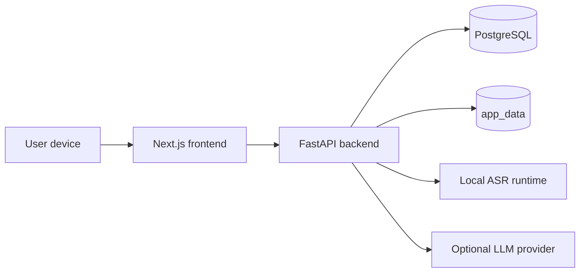

# trace_itself

     

`trace_itself` is a self-hosted personal execution intelligence system for multi-track learning, project delivery, daily accountability, and private audio workflows.

It is designed to feel like a command center for real work, not a decorative productivity app.

## What's New

Latest deployed updates are listed here so reviewers can immediately see what changed and when it shipped.

### Deployed 2026-03-27

- `Security Hardening Pass`
  Added backend-enforced idle session expiry, password-reset session revocation, bounded live-ASR chunk and utterance handling, stricter Gemini provider URL validation, and safer production startup checks for secrets and secure cookies.
- `Mission Control Dashboard`
  Rebuilt the dashboard into a high-signal command center with `Now`, `Alerts`, `Mission Timeline`, `Execution Flow`, `Project Radar`, `Reality Gap`, and `Weekly Command Review`.
- `Dashboard Intelligence APIs`
  Added focused backend modules for `next-actions`, `stagnation`, `reality-gap`, `weekly-review`, `activity-feed`, and `timeline`, so each dashboard panel has a clear contract.
- `Mini Gantt Timeline`
  Added a lightweight read-only project and milestone timeline with a fixed 60-day window, a `Today` marker, target-date markers, and overdue emphasis.
- `Version A Login Entry`
  Reframed the login page as a real product entry point for private testing, with future-ready Google, GitHub, and Email auth options and cleaner mobile-to-desktop behavior.
- `Portfolio-Ready Product Framing`
  Upgraded the README and architecture docs so the project presents as a serious personal execution system rather than a generic task tracker.
- `Long Live Recording Stability`
  Fixed `Live ASR error: Internal Server Error` on longer live recordings by streaming the final multipart upload through the Next.js proxy instead of reparsing the full file in memory first.

### Deployed 2026-03-26

- `Audio Workspace`
  Added private ASR transcription, meeting-note workflows, and audio processing capabilities for local-first capture and review.
- `Product Updates Surface`
  Added a product updates flow so changes can be surfaced inside the app instead of living only in commit history.

## What This System Is

`trace_itself` answers the operational questions that matter:

- What am I working on right now?
- What is overdue?
- Which important track is drifting?
- What did I actually do recently?
- What should I do next?
- Where is time going?
- Which long-horizon missions are progressing versus stalling?

The product is intentionally positioned as:

> A self-hosted personal execution intelligence system for multi-track learning and project operations.

## What Makes It Different

This repo is not trying to be:

- a generic to-do list
- a note-taking app with charts
- a flashy productivity dashboard
- an enterprise PM suite

Instead, it aims to be:

- high-signal
- operational
- personally useful
- interview-ready
- portfolio-ready
- technically explainable

## Core Product Modules

### 1. Mission Control Dashboard

The dashboard is the command center. It includes:

- `Next Action Engine`
- `Stagnation Detector`
- `Mission Timeline`
- `Execution Flow`
- `Project Radar`
- `Reality Gap Analyzer`
- `Weekly Command Review`

### 2. Project Tracer

Structured execution model for:

- projects
- milestones
- tasks
- daily logs

### 3. Audio Workspace

Private audio workflows with:

- local ASR
- transcript storage
- meeting notes
- summaries and action items

## Live ASR Long Recording Fix

Long live sessions could fail when saving the take after recording for an extended period, even though live chunk transcription itself was still working.

- `Symptom`
  Users could record for a long live session, stop normally, and then hit `Live ASR error: Internal Server Error` during the final save step.
- `What actually failed`
  The fragile part was not the PCM chunk streaming into the backend. The failure happened later, when the browser-uploaded recording was sent to the live-session `persist` endpoint.
- `Root cause`
  Most `/api/*` traffic is sent to FastAPI through a plain Next.js rewrite, but the live-session endpoints use a custom route handler. That proxy was calling `request.formData()` before forwarding the request, which forced Next.js to parse and buffer the full multipart body again. Longer recordings made that extra parse much more likely to fail.
- `How it was fixed`
  The proxy now forwards the original multipart request body as a stream, preserves the incoming `content-type` boundary and `content-length`, and uses `duplex: 'half'` so Node can pass the upload through to FastAPI without rebuilding the whole form in memory first.
- `Why this fix is targeted`
  The bug was isolated to the live-session save path because it was the one audio flow using the custom Next.js proxy instead of the simpler rewrite path.

## Security Hardening

This repo now includes a focused backend hardening pass for the highest-risk items found in review:

- password resets revoke every existing session for that account
- the backend enforces the idle session timeout instead of relying only on the frontend countdown
- production startup now fails closed if placeholder secrets are still present, `CREDENTIALS_SECRET_KEY` is missing, or `SESSION_COOKIE_SECURE` is left off
- live ASR chunks are size-limited and long uninterrupted utterances are force-committed so one session cannot grow unbounded in memory
- Gemini provider URLs are restricted to the official Google Generative Language API host instead of allowing arbitrary outbound URLs
- backend dependency pins were updated for the reported FastAPI/Starlette, Requests, Cryptography, and multipart advisories

New security-related environment settings:

- `APP_ENV`
- `SESSION_IDLE_TIMEOUT_MINUTES`
- `ASR_LIVE_MAX_CHUNK_KB`
- `ASR_LIVE_MAX_UTTERANCE_SECONDS`
- `ASR_LIVE_MAX_SESSIONS_PER_USER`

## Architecture

- `Frontend`
  Next.js App Router + React
- `Backend`
  FastAPI + SQLAlchemy
- `Database`
  PostgreSQL
- `Deployment`
  Docker Compose
- `Access model`
  private-first, localhost-bound services with Tailscale-first remote access

### Topology



## Dashboard Intelligence Endpoints

The mission-control dashboard is backed by focused endpoints:

- `GET /dashboard/summary`
- `GET /dashboard/next-actions`
- `GET /dashboard/stagnation`
- `GET /dashboard/reality-gap`
- `GET /dashboard/weekly-review`
- `GET /dashboard/activity-feed`
- `GET /dashboard/timeline`

This decomposition keeps the backend explainable and lets the frontend degrade gracefully if one module fails.

## Repo Layout

```text
.
├── backend/
│   ├── app/
│   │   ├── api/
│   │   ├── core/
│   │   ├── db/
│   │   ├── models/
│   │   ├── schemas/
│   │   ├── services/
│   │   └── main.py
│   ├── Dockerfile
│   └── requirements.txt
├── docs/
│   ├── dashboard-architecture.md
│   ├── deployment.md
│   ├── future-roadmap.md
│   ├── product-overview.md
│   └── tailscale.md
├── frontend/
│   ├── public/
│   ├── src/
│   │   ├── app/
│   │   ├── components/
│   │   ├── features/
│   │   ├── lib/
│   │   └── state/
│   ├── Dockerfile
│   └── package.json
├── scripts/
├── docker-compose.yml
└── README.md
```

## Quick Start

### 1. Create environment config

```bash
cp .env.example .env
```

Set at least:

- `APP_ENV` with `development` locally and `production` for real deployment
- `POSTGRES_PASSWORD`
- `SECRET_KEY`
- `CREDENTIALS_SECRET_KEY`
- `INITIAL_ADMIN_USERNAME`
- `INITIAL_ADMIN_PASSWORD`

For remote/private deployment over HTTPS, also set:

- `SESSION_COOKIE_SECURE=true`
- `SESSION_IDLE_TIMEOUT_MINUTES=5`

### 2. Start the stack

```bash
docker compose up --build -d
```

### 3. Open the app

- frontend: `http://127.0.0.1:3000`
- backend API: `http://127.0.0.1:8000`

Sign in with:

- `INITIAL_ADMIN_USERNAME`
- `INITIAL_ADMIN_PASSWORD`

## Local Development

### Backend

```bash
python3 -m venv .venv
source .venv/bin/activate
pip install -r backend/requirements.txt
cd backend
uvicorn app.main:app --reload
```

### Frontend

```bash
cd frontend
npm install
npm run dev
```

## Deployment

For real deployment details, use:

- [deployment guide](/home/jnln3799/every_on_git_ubuntu/trace_itself/docs/deployment.md)
- [Tailscale guide](/home/jnln3799/every_on_git_ubuntu/trace_itself/docs/tailscale.md)

Recommended posture:

- `APP_ENV=production` on real deployments
- frontend bound to `127.0.0.1:3000`
- backend bound to `127.0.0.1:8000`
- database only on Docker internal network
- private remote access through Tailscale Serve

## Why This Project Matters

This repo is strong portfolio material because it demonstrates:

- product framing beyond CRUD
- high-signal dashboard thinking
- pragmatic full-stack architecture
- API design discipline
- systems thinking around drift, execution, and feedback loops
- deployability on a private self-hosted machine

It gives interviewers and reviewers something more interesting to discuss than “I built a to-do app.”

## Documentation

- [Product overview](/home/jnln3799/every_on_git_ubuntu/trace_itself/docs/product-overview.md)
- [Dashboard architecture](/home/jnln3799/every_on_git_ubuntu/trace_itself/docs/dashboard-architecture.md)
- [Login entry, Version A](/home/jnln3799/every_on_git_ubuntu/trace_itself/docs/auth-entry-v1.md)
- [Deployment](/home/jnln3799/every_on_git_ubuntu/trace_itself/docs/deployment.md)
- [Future roadmap](/home/jnln3799/every_on_git_ubuntu/trace_itself/docs/future-roadmap.md)
- [Tailscale private access](/home/jnln3799/every_on_git_ubuntu/trace_itself/docs/tailscale.md)

## Why It Exists

The point of `trace_itself` is simple:

- make execution visible
- make drift obvious
- keep the stack understandable
- keep the data private
- build a system that is useful in daily life and impressive in technical discussion

That is the standard.
