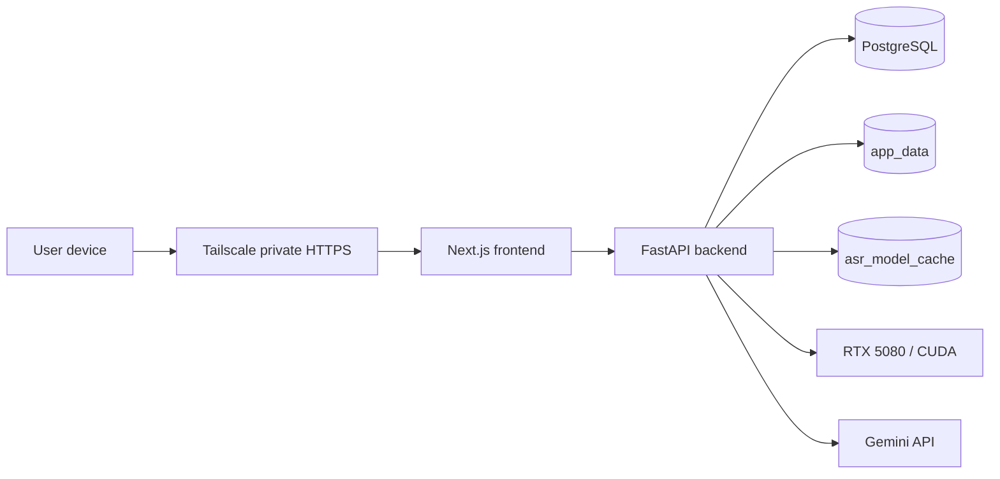
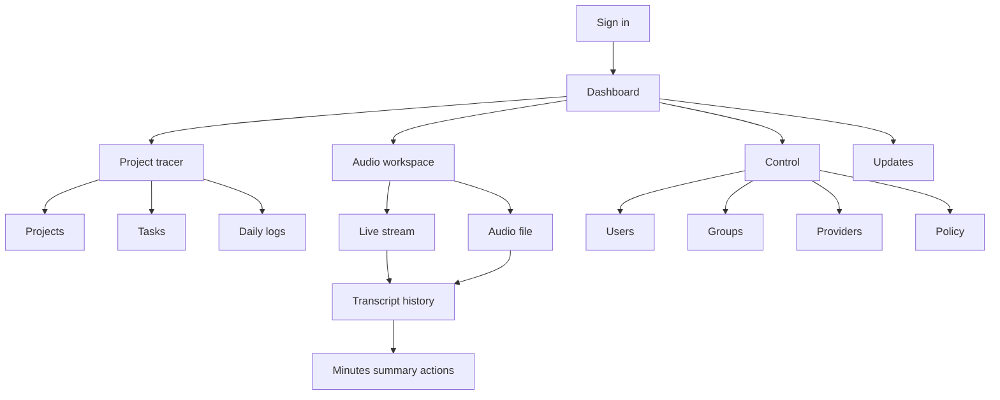
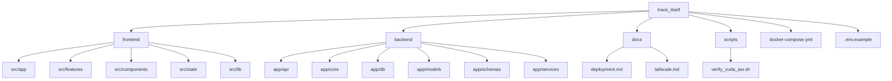
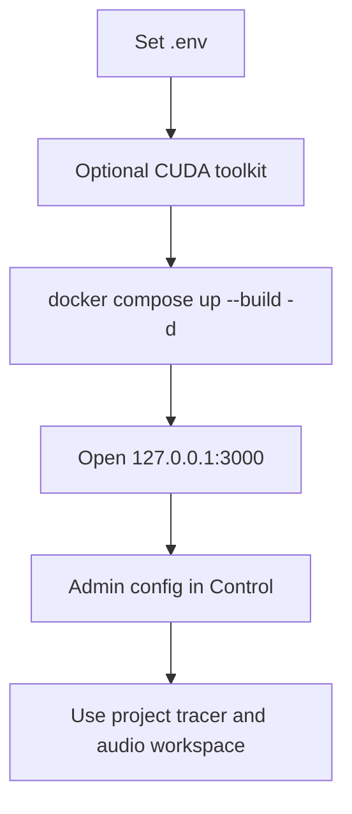
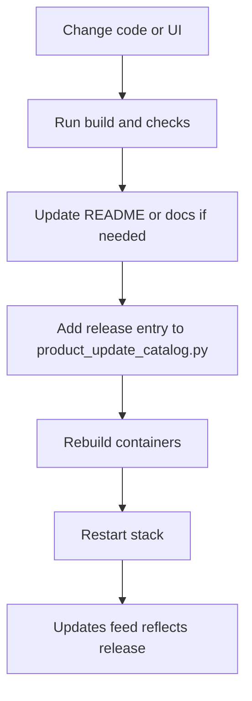
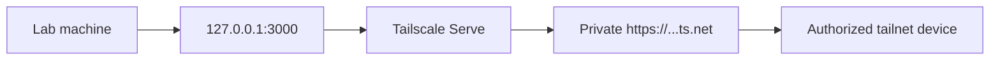

# trace_itself

     

`trace_itself` is a private operating surface for real work.

This is not a generic productivity app. It is a self-hosted execution dashboard for long-horizon learning, project delivery, daily accountability, and private audio workflows. The goal is simple: know what matters, know what is late, know what happened today, and move faster without leaking your data.

Maintained by Jason Chia-Sheng Lin, PhD student at Institute of Biophotonics, NYCU. Feel free to contact me.

## Mission

Build a system that answers four questions with minimal friction:

- What am I working on?
- What is overdue?
- What did I do today?
- What should happen next?

And do it with a private-first architecture that can run on one lab machine, stay understandable, and scale in capability without collapsing into complexity.

## Product Surface

Today the product has two primary workspaces:

- `Project tracer`
  Projects, milestones, tasks, dashboard views, and daily logs
- `Audio workspace`
  Live or file-based transcription, saved transcript history, meeting notes, summaries, and action items

The system also includes:

- multi-user accounts with private per-user data
- admin control for groups, providers, policy, and device limits
- a read-only updates feed with versioned release history
- private remote access through Tailscale-first deployment

## First-Principles Design

- Private by default
  The app binds to localhost. Postgres is never published. Remote access is expected to run through a private network layer such as Tailscale.
- Narrow scope beats fake completeness
  Every feature must help with execution, clarity, or safety.
- One machine, real output
  Local ASR runs on the lab server. Audio stays local unless you explicitly enable an external LLM provider for summaries.
- Clear systems win
  The repo should stay legible. The deployment path should stay boring. The recovery path should stay obvious.
- Human factors matter
  The UI is designed to reduce scanning cost, shorten the path to action, and keep the signal visible.

## Current Capabilities

- private user accounts with isolated data
- admin-managed users, access groups, AI providers, and budget policy
- temporary lockout after repeated failed logins
- per-user concurrent device limits
- 5-minute idle timeout with visible countdown and audio-work pause
- dashboard for active work, overdue tasks, today tasks, milestones, logs, and updates
- CRUD for projects, milestones, tasks, and daily logs
- local Breeze ASR 25 via faster-whisper on CUDA
- live streaming ASR with rolling transcript lines and timestamps
- saved transcript history with audio playback and TXT export
- meeting workflow with transcript, minutes, summary, and action items
- read-only updates feed backed by source-controlled release entries

## Architecture At A Glance

- `Frontend`
  Next.js App Router + React
- `Backend`
  FastAPI + SQLAlchemy
- `Database`
  PostgreSQL 16
- `Local ASR`
  SoybeanMilk/faster-whisper-Breeze-ASR-25
- `Speech gating`
  Silero-backed live segmentation with browser-side noise handling
- `Meeting summarizer`
  Gemini 3.1 Flash-Lite API
- `Secrets`
  encrypted provider key storage in Postgres
- `Deployment`
  Docker Compose on a lab machine
- `Remote access`
  Tailscale Serve over private HTTPS

## System Topology



Why this shape:

- the frontend and backend stay local to the host
- the database stays internal-only
- ASR runs on your own machine
- the only external AI path is optional meeting summarization
- the operational model stays simple enough to debug at 2 AM

## Product Flow



## Repo Layout

```text
.
├── backend/
│   ├── app/
│   │   ├── api/
│   │   ├── core/
│   │   ├── db/
│   │   ├── models/
│   │   ├── schemas/
│   │   ├── services/
│   │   └── main.py
│   ├── Dockerfile
│   └── requirements.txt
├── docs/
│   ├── deployment.md
│   └── tailscale.md
├── frontend/
│   ├── public/
│   ├── src/
│   │   ├── app/
│   │   ├── components/
│   │   ├── features/
│   │   ├── lib/
│   │   └── state/
│   ├── Dockerfile
│   ├── next.config.mjs
│   └── package.json
├── scripts/
│   └── verify_cuda_asr.sh
├── .env.example
├── docker-compose.yml
└── README.md
```

## Repo Structure Map



## Quick Start

### 1. Create `.env`

```bash
cp .env.example .env
```

Set at least:

- `POSTGRES_PASSWORD`
- `SECRET_KEY`
- `CREDENTIALS_SECRET_KEY`
- `INITIAL_ADMIN_USERNAME`
- `INITIAL_ADMIN_PASSWORD`
- `DEFAULT_LLM_RUNS_PER_24H`
- `DEFAULT_MAX_AUDIO_SECONDS_PER_REQUEST`

Recommended ASR values:

```env
ASR_MODEL_NAME=SoybeanMilk/faster-whisper-Breeze-ASR-25
ASR_DEVICE=cuda
ASR_COMPUTE_TYPE=float16
ASR_LIVE_PARTIAL_INTERVAL_MS=1500
ASR_LIVE_COMMIT_SILENCE_MS=1200
ASR_MAX_UPLOAD_MB=512
```

Optional meeting-note values:

```env
GEMINI_API_KEY=...
GEMINI_MODEL=gemini-3.1-flash-lite-preview
MEETING_MAX_UPLOAD_MB=512
```

### 2. Enable CUDA for Docker

If you want local ASR on the RTX 5080, install NVIDIA Container Toolkit first:

```bash
curl -fsSL https://nvidia.github.io/libnvidia-container/gpgkey | \
  sudo gpg --dearmor -o /usr/share/keyrings/nvidia-container-toolkit-keyring.gpg
curl -fsSL https://nvidia.github.io/libnvidia-container/stable/deb/nvidia-container-toolkit.list | \
  sed 's#deb https://#deb [signed-by=/usr/share/keyrings/nvidia-container-toolkit-keyring.gpg] https://#g' | \
  sudo tee /etc/apt/sources.list.d/nvidia-container-toolkit.list > /dev/null
sudo apt-get update
sudo apt-get install -y nvidia-container-toolkit
sudo nvidia-ctk runtime configure --runtime=docker
sudo systemctl restart docker
```

Verify the CUDA path:

```bash
./scripts/verify_cuda_asr.sh
```

### 3. Start the stack

```bash
docker compose up --build -d
```

### 4. Open the app

- frontend: `http://127.0.0.1:3000`
- backend API: `http://127.0.0.1:8000`

Sign in with:

- `INITIAL_ADMIN_USERNAME`
- `INITIAL_ADMIN_PASSWORD`

## Startup SOP



## Operating SOPs

### Docker Update Matrix

Use this rule set:

- frontend code changed

  ```bash
  docker compose up --build -d frontend
  ```

- backend code changed

  ```bash
  docker compose up --build -d backend
  ```

- both changed or not sure

  ```bash
  docker compose up --build -d
  ```

- only restart, no rebuild

  ```bash
  docker compose restart frontend backend
  ```

- `.env`, Dockerfile, Compose, or Next config changed

  ```bash
  docker compose up --build -d
  ```

### Delivery Workflow



### Release Log SOP

- The `Updates` page is read-only for users.
- Release history lives in `backend/app/core/product_update_catalog.py`.
- Add a new entry with:
  - `entry_key`
  - `version_tag`
  - `title`
  - `summary`
  - `details`
  - `area`
  - `change_type`
  - `changed_at`
- Rebuild the backend after catalog changes.
- Startup sync will write the catalog into Postgres and remove stale entries that no longer exist in source.

### Schema Change SOP

This repo does not use Alembic yet. Treat schema work seriously.

Current model:

- `create_all()` creates missing tables
- `backend/app/db/bootstrap.py` applies explicit upgrade SQL

Rules:

- no schema change

  ```bash
  docker compose up --build -d backend
  ```

- small schema change with matching bootstrap SQL

  ```bash
  docker compose up --build -d backend
  ```

- risky schema change on real data

  make a real migration step first

- disposable dev reset

  ```bash
  docker compose down -v
  docker compose up --build -d
  ```

Warning: `docker compose down -v` deletes Postgres data and app data.

Backup first:

```bash
docker compose exec db sh -lc 'pg_dump -U "$POSTGRES_USER" "$POSTGRES_DB"' > trace_itself_backup.sql
```

## ASR Operating Notes

- the first transcription downloads the model into `asr_model_cache`
- local ASR runs on the lab machine instead of a third-party ASR service
- live ASR streams rolling audio chunks instead of waiting for a full upload
- transcript lines stay timestamped during the session
- saved transcripts keep per-user history and support TXT export
- browser capture uses echo cancellation, noise suppression, adaptive loudness control, and compressed recording
- audio budget is policy-controlled; default cap is 5 hours per file
- the first live chunk can be slower if the model cache is cold

## Meeting Notes Operating Notes

- the Audio workspace starts with local ASR
- Gemini is optional and used only for notes generation
- if `GEMINI_API_KEY` is absent, transcript flows still work
- meeting-note generation follows the text-run budget policy
- provider visibility is permission-aware per user

## Control Plane

The `Control` page is the operating console for the system.

Admins can:

- create, edit, unlock, deactivate, and delete users
- assign users to one of three default groups:
  - `Full access`
  - `Projects only`
  - `Audio workspace`
- set per-user concurrent device limits
- store ASR and LLM provider settings
- activate or retire providers
- set text-run and max-audio policy

## Security Posture

- localhost-only frontend and backend exposure by default
- Postgres stays internal to Docker
- signed session cookies
- hashed passwords
- temporary lockout after repeated failed logins
- visible idle timeout with automatic sign-out
- per-user concurrent session limits
- encrypted provider API keys in the database
- private remote access through Tailscale Serve

## Private Remote Access

Use `trace_itself` like this:



Recommended flow:

1. start the app
2. sign into Tailscale on the lab machine
3. run

   ```bash
   sudo tailscale serve --bg 3000
   tailscale serve status
   tailscale funnel status
   ```

4. open the private `https://...ts.net` URL from a device in the same tailnet

Important:

- use `tailscale serve`, not `tailscale funnel`
- keep `SESSION_COOKIE_SECURE=true` for real remote use
- do not expose Postgres or backend ports publicly

See:

- `docs/deployment.md`
- `docs/tailscale.md`

## Local Development

### Backend

```bash
python3 -m venv .venv
source .venv/bin/activate
pip install -r backend/requirements.txt
cd backend
uvicorn app.main:app --reload
```

If you want Postgres in Docker:

```bash
docker compose up -d db
```

### Frontend

```bash
cd frontend
npm install
npm run dev
```

The Next.js dev server proxies `/api` to `API_PROXY_TARGET`. See `frontend/.env.example`.

## Why This Repo Matters

Most personal productivity software is noisy, public by default, or structurally weak.

This repo is trying to do something simpler and harder:

- own the stack
- own the data
- keep the system small enough to reason about
- make execution visible
- make progress measurable
- make audio capture useful without surrendering privacy

That is the standard.

## Suggested Next Steps

1. Add Alembic before schema change velocity increases.
2. Add backups and restore automation for Postgres and app data.
3. Add deeper project health metrics and trend views.
4. Add better mobile ergonomics and accessibility auditing.
5. Add MFA or stronger recovery flows if the trusted-user model expands.
