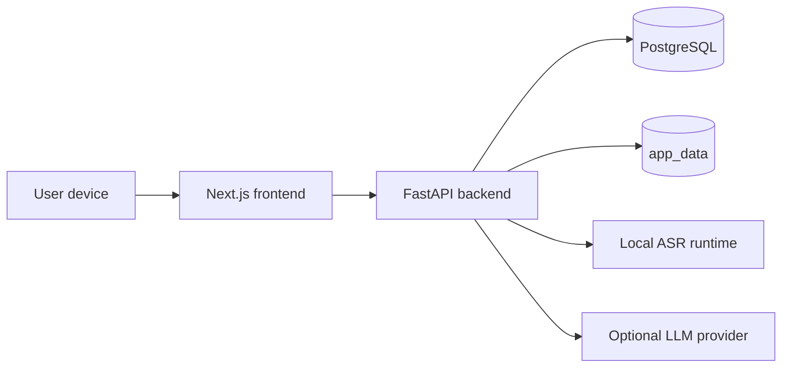

# trace_itself

     

`trace_itself` is a self-hosted personal execution intelligence system for multi-track learning, project delivery, daily accountability, and private audio workflows.

It is designed to feel like a command center for real work, not a decorative productivity app.

## What's New

Latest repo updates are listed here so reviewers can immediately see what changed and when it landed.

### Updated 2026-03-29

- `Faster Live Save + Background Replay Refinement`
  Stopping live ASR now saves the transcript row immediately, stores replay audio first, and moves long saved-audio transcription plus diarization work into a background task so long takes do not hold the stop/save request open.
- `Expanded Transcript Diarization`
  Added optional multi-speaker diarization to transcript file uploads, kept live streaming speaker-blind during capture, and now runs diarization on saved live takes by default when replay audio uploads successfully.
- `Diarization Tuning`
  Reduced diarization sensitivity by moving speaker assignment to segment-level transcript spans, smoothing isolated speaker flips, defaulting new diarized flows to a lower speaker cap, and keeping visible labels reindexed as clean `Speaker 1..N`.
- `Smoother Live PCM + Safer Transport`
  Clarified the browser-side PCM conditioning path for live ASR, kept live uploads on normalized `16 kHz` mono PCM with smaller transport batches for unstable connections, and reduced saved replay recordings to `64 kbps` so stop/save uploads are smaller without changing the live transcript path.

### Updated 2026-03-27

- `Security Hardening Pass`
  Added backend-enforced idle session expiry, password-reset session revocation, bounded live-ASR chunk and utterance handling, stricter Gemini provider URL validation, and safer production startup checks for secrets and secure cookies.
- `Optional Meeting Diarization`
  Added an opt-in multi-speaker meeting mode that keeps the default ASR path unchanged, but can run NeMo Sortformer diarization for uploaded meeting audio and store speaker-attributed transcript lines for summaries, minutes, and action items.
- `Mission Control Dashboard`
  Rebuilt the dashboard into a high-signal command center with `Now`, `Alerts`, `Mission Timeline`, `Execution Flow`, `Project Radar`, `Reality Gap`, and `Weekly Command Review`.
- `Dashboard Intelligence APIs`
  Added focused backend modules for `next-actions`, `stagnation`, `reality-gap`, `weekly-review`, `activity-feed`, and `timeline`, so each dashboard panel has a clear contract.
- `Mini Gantt Timeline`
  Added a lightweight read-only project and milestone timeline with a fixed 60-day window, a `Today` marker, target-date markers, and overdue emphasis.
- `Version A Login Entry`
  Reframed the login page as a real product entry point for private testing, with future-ready Google, GitHub, and Email auth options and cleaner mobile-to-desktop behavior.
- `Portfolio-Ready Product Framing`
  Upgraded the README and architecture docs so the project presents as a serious personal execution system rather than a generic task tracker.
- `Long Live Recording Stability`
  Hardened live ASR by streaming long final uploads through the proxy, keeping live capture active across in-app navigation, and cleaning up false multi-session conflicts.

### Updated 2026-03-26

- `Audio Workspace`
  Added private ASR transcription, meeting-note workflows, and audio processing capabilities for local-first capture and review.
- `Product Updates Surface`
  Added a product updates flow so changes can be surfaced inside the app instead of living only in commit history.

## What This System Is

`trace_itself` answers the operational questions that matter:

- What am I working on right now?
- What is overdue?
- Which important track is drifting?
- What did I actually do recently?
- What should I do next?
- Where is time going?
- Which long-horizon missions are progressing versus stalling?

The product is intentionally positioned as:

> A self-hosted personal execution intelligence system for multi-track learning and project operations.

## What Makes It Different

This repo is not trying to be:

- a generic to-do list
- a note-taking app with charts
- a flashy productivity dashboard
- an enterprise PM suite

Instead, it aims to be:

- high-signal
- operational
- personally useful
- interview-ready
- portfolio-ready
- technically explainable

## Core Product Modules

### 1. Mission Control Dashboard

The dashboard is the command center. It includes:

- `Next Action Engine`
- `Stagnation Detector`
- `Mission Timeline`
- `Execution Flow`
- `Project Radar`
- `Reality Gap Analyzer`
- `Weekly Command Review`

### 2. Project Tracer

Structured execution model for:

- projects
- milestones
- tasks
- daily logs

### 3. Audio Workspace

Private audio workflows with:

- local ASR
- optional speaker diarization for transcripts, meetings, and saved live takes
- transcript storage
- meeting notes
- summaries and action items

## Optional Speaker Diarization

Speaker diarization now covers three audio paths with different defaults:

- `Default behavior stays the same`
  Plain transcript uploads still default to the existing single-speaker path unless you opt in.
- `Transcript opt-in`
  The `Transcript` file-upload form exposes `Multi-speaker diarization` for uploaded audio where more than one person is talking.
- `Saved live takes`
  Live ASR itself stays speaker-blind for low-latency streaming, but once a live take is stopped and saved, the app now stores the transcript immediately, uploads replay audio first, and then tries saved-audio diarization in the background by default. The transcript view shows `Queued`, `Refining`, or `Replay failed` while that replay pass is still running.
- `Not true real-time live diarization`
  Speaker labels are not assigned while the microphone stream is still running. That remains a later step so the current live capture path stays low-latency and stable.
- `Meeting notes`
  The `Notes` form still exposes `Multi-speaker diarization` for meeting-style uploads that also generate summaries, minutes, and action items.
- `Path B integration`
  The app keeps its current FastAPI and browser transport/session flow, uses faster-whisper for transcription, and adds a raw NeMo Sortformer diarizer on top of saved-audio workflows instead of replacing the live transport stack.
- `Runtime note`
  Saved audio is normalized to mono `16 kHz` WAV before the NeMo diarizer runs, which keeps WebM and other browser-recorded uploads compatible with the Sortformer path.
- `Why this split matters`
  Live streaming stays fast and stable, while saved audio workflows can add speaker-attributed transcript lines where they are most useful.

## Live ASR Stability Fixes

Recent live ASR work focused on three different failure modes: long recording saves, cross-page browsing while recording, and false "too many sessions" limits.

- `Symptom`
  Users could hit `Live ASR error: Internal Server Error` after longer recordings, lose the live stream when leaving the `Audio` page, or see `Too many live ASR sessions are already open for this account` even though only one visible session existed.
- `Long recording save fix`
  The fragile part was not the PCM chunk streaming itself. The failure happened later, when the browser-uploaded recording was sent to the live-session `persist` endpoint. That proxy was reparsing multipart uploads with `request.formData()`, so longer recordings were buffered a second time inside Next.js before FastAPI ever received them.
- `Upload-path fix`
  The proxy now forwards the original multipart request body as a stream, preserves the incoming `content-type` boundary and `content-length`, and uses `duplex: 'half'` so Node can pass the upload through without rebuilding the whole form in memory first.
- `Burst-handling fix`
  The backend now accepts live chunk requests up to `2048 KB`, while the browser sends much smaller transport batches by default. Normal live uploads now target about `32 KB` with a short max-wait guard, but the backend still keeps its own rolling decoder window and utterance buffer so recognition context does not shrink with transport size.
- `Browser PCM conditioning`
  Before PCM leaves the browser, the live microphone path is forced to mono, passed through a high-pass filter and light compressor, then normalized and noise-gated inside the audio worklet before being resampled to `16 kHz` PCM. This keeps the live stream smoother for ASR on ordinary laptop microphones without tying transcript quality to the saved replay file bitrate.
- `Why the transport split matters`
  The browser-side upload granularity is now a transport concern instead of a recognition concern. In other words, a `32 KB` upload is not treated like a final mini-transcript. The backend still aggregates those uploads into larger utterance state, refreshes partials from its own rolling preview window, and only commits final text on silence or utterance-length boundaries.
- `Safer internet behavior`
  Smaller default PCM batches plus a short flush timer make temporary network stalls less likely to turn into oversized uploads, while the backend still keeps a much larger hard ceiling so brief browser-side bursts do not immediately fail the session.
- `Cross-page live-session fix`
  The live recorder no longer lives only inside the `Audio` page component. Its session state now sits at the authenticated app-shell level, so users can browse other pages in the app while the microphone stream keeps running and return through a compact live dock.
- `Why this is cool`
  The `Audio` page still gives the full transcript log and controls, but it is no longer the single place that has to stay mounted for recording to survive. The recorder now acts more like a real workspace tool: start in `Audio`, move to `Projects` or `Tasks` while speaking, then come back or use the dock to stop, save, or reopen the result.
- `Scope`
  This fix covers in-app route changes inside the authenticated shell. A full browser refresh, tab close, or browser crash still ends microphone capture because the recording pipeline lives in browser memory and cannot survive a page unload.
- `False multi-session fix`
  The backend now counts only non-finalized live sessions toward the open-session limit, reaps obviously orphaned pre-start sessions, and the frontend blocks duplicate `startLive()` races so one visible recording does not leak ghost sessions behind the scenes.
- `Operational note`
  Live ASR sessions are kept in backend memory, so after deploying session-lifecycle fixes it is worth restarting the backend once to clear any stale in-memory sessions that were created before the patch.
- `Saved-live diarization scope`
  The saved-live diarization pass only runs when the stop/save flow successfully uploads replay audio. If the save falls back to transcript-only persistence, the transcript is still preserved, but there is no audio file left to diarize afterward.
- `Fast stop/save path`
  The long replay-audio reprocessing step no longer blocks the initial stop/save response. The app now saves the streamed transcript immediately, stores replay audio quickly, and lets full-file replay refinement plus diarization finish in a background task that updates the same transcript row later.
- `Smaller saved replay files`
  The browser-side `MediaRecorder` bitrate for saved live replay audio is now `64000` instead of `128000`. That mainly affects the replay file that is attached during stop/save; it does not materially change the real-time ASR path because live recognition still runs on the worklet-generated PCM stream.

## Security Hardening

This repo now includes a focused backend hardening pass for the highest-risk items found in review:

- password resets revoke every existing session for that account
- the backend enforces the idle session timeout instead of relying only on the frontend countdown
- production startup now fails closed if placeholder secrets are still present, `CREDENTIALS_SECRET_KEY` is missing, or `SESSION_COOKIE_SECURE` is left off
- live ASR chunks are size-limited and long uninterrupted utterances are force-committed so one session cannot grow unbounded in memory
- Gemini provider URLs are restricted to the official Google Generative Language API host instead of allowing arbitrary outbound URLs
- backend dependency pins were updated for the reported FastAPI/Starlette, Requests, Cryptography, and multipart advisories

New security-related environment settings:

- `APP_ENV`
- `SESSION_IDLE_TIMEOUT_MINUTES`
- `ASR_LIVE_MAX_CHUNK_KB`
- `NEXT_PUBLIC_ASR_LIVE_TRANSPORT_TARGET_KB`
- `NEXT_PUBLIC_ASR_LIVE_TRANSPORT_MAX_WAIT_MS`
- `ASR_LIVE_MAX_UTTERANCE_SECONDS`
- `ASR_LIVE_MAX_SESSIONS_PER_USER`

Live ASR tuning is intentionally split across three layers:

- `Browser PCM conditioning`
  The worklet path applies mono capture, high-pass cleanup, light compression, adaptive gain, noise gating, and `16 kHz` resampling before the browser queues PCM for upload.
- `Transport`
  `NEXT_PUBLIC_ASR_LIVE_TRANSPORT_TARGET_KB` and `NEXT_PUBLIC_ASR_LIVE_TRANSPORT_MAX_WAIT_MS` control how often the browser uploads PCM to the backend.
- `Decoder context`
  `ASR_LIVE_MAX_WINDOW_SECONDS` controls how much recent audio is used for rolling preview decoding.
- `Utterance commit`
  `ASR_LIVE_COMMIT_SILENCE_MS` and `ASR_LIVE_MAX_UTTERANCE_SECONDS` control when buffered speech is turned into a committed transcript entry.

## Architecture

- `Frontend`
  Next.js App Router + React
- `Backend`
  FastAPI + SQLAlchemy
- `Database`
  PostgreSQL
- `Deployment`
  Docker Compose
- `Access model`
  private-first, localhost-bound services with Tailscale-first remote access

### Topology



## Dashboard Intelligence Endpoints

The mission-control dashboard is backed by focused endpoints:

- `GET /dashboard/summary`
- `GET /dashboard/next-actions`
- `GET /dashboard/stagnation`
- `GET /dashboard/reality-gap`
- `GET /dashboard/weekly-review`
- `GET /dashboard/activity-feed`
- `GET /dashboard/timeline`

This decomposition keeps the backend explainable and lets the frontend degrade gracefully if one module fails.

## Repo Layout

```text
.
├── backend/
│   ├── app/
│   │   ├── api/
│   │   ├── core/
│   │   ├── db/
│   │   ├── models/
│   │   ├── schemas/
│   │   ├── services/
│   │   └── main.py
│   ├── Dockerfile
│   └── requirements.txt
├── docs/
│   ├── dashboard-architecture.md
│   ├── deployment.md
│   ├── future-roadmap.md
│   ├── product-overview.md
│   └── tailscale.md
├── frontend/
│   ├── public/
│   ├── src/
│   │   ├── app/
│   │   ├── components/
│   │   ├── features/
│   │   ├── lib/
│   │   └── state/
│   ├── Dockerfile
│   └── package.json
├── scripts/
├── docker-compose.yml
└── README.md
```

## Quick Start

### 1. Create environment config

```bash
cp .env.example .env
```

Set at least:

- `APP_ENV` with `development` locally and `production` for real deployment
- `POSTGRES_PASSWORD`
- `SECRET_KEY`
- `CREDENTIALS_SECRET_KEY`
- `INITIAL_ADMIN_USERNAME`
- `INITIAL_ADMIN_PASSWORD`

For remote deployment over Tailscale HTTPS, also set:

- `SESSION_COOKIE_SECURE=true`
- `SESSION_IDLE_TIMEOUT_MINUTES=5`

For public internet exposure through Tailscale Funnel, also make sure:

- `APP_ENV=production`
- `CREDENTIALS_SECRET_KEY` is set to a dedicated strong value
- only the frontend is published publicly
- you are comfortable with the login page being public and receiving ordinary internet scanner traffic

### 2. Start the stack

```bash
docker compose up --build -d
```

### 3. Open the app

- frontend: `http://127.0.0.1:3000`
- backend API: `http://127.0.0.1:8000`

Sign in with:

- `INITIAL_ADMIN_USERNAME`
- `INITIAL_ADMIN_PASSWORD`

## Local Development

### Backend

```bash
python3 -m venv .venv
source .venv/bin/activate
uv pip install -r backend/requirements.txt
cd backend
uvicorn app.main:app --reload
```

### Frontend

```bash
cd frontend
npm install
npm run dev
```

## Deployment

For real deployment details, use:

- [deployment guide](/home/jnln3799/every_on_git_ubuntu/trace_itself/docs/deployment.md)
- [Tailscale guide](/home/jnln3799/every_on_git_ubuntu/trace_itself/docs/tailscale.md)

Recommended posture:

- `APP_ENV=production` on real deployments
- frontend bound to `127.0.0.1:3000`
- backend bound to `127.0.0.1:8000`
- database only on Docker internal network
- private remote access through Tailscale Serve
- optional public demo exposure through Tailscale Funnel only when you intentionally want open-internet access to the login page

Important Funnel warnings:

- Funnel makes the site reachable from the public internet, not just your tailnet
- the login page becomes public even though self-serve signup is not live
- you should expect background scanner traffic such as `/.env`, `/login`, or unrelated bot probes in your logs
- keep the backend on localhost and publish only the frontend entrypoint

## Why This Project Matters

This repo is strong portfolio material because it demonstrates:

- product framing beyond CRUD
- high-signal dashboard thinking
- pragmatic full-stack architecture
- API design discipline
- systems thinking around drift, execution, and feedback loops
- deployability on a private self-hosted machine

It gives interviewers and reviewers something more interesting to discuss than “I built a to-do app.”

## Documentation

- [Product overview](/home/jnln3799/every_on_git_ubuntu/trace_itself/docs/product-overview.md)
- [Dashboard architecture](/home/jnln3799/every_on_git_ubuntu/trace_itself/docs/dashboard-architecture.md)
- [Login entry, Version A](/home/jnln3799/every_on_git_ubuntu/trace_itself/docs/auth-entry-v1.md)
- [Deployment](/home/jnln3799/every_on_git_ubuntu/trace_itself/docs/deployment.md)
- [Future roadmap](/home/jnln3799/every_on_git_ubuntu/trace_itself/docs/future-roadmap.md)
- [Tailscale access guide](/home/jnln3799/every_on_git_ubuntu/trace_itself/docs/tailscale.md)

## Why It Exists

The point of `trace_itself` is simple:

- make execution visible
- make drift obvious
- keep the stack understandable
- keep the data private
- build a system that is useful in daily life and impressive in technical discussion

That is the standard.
