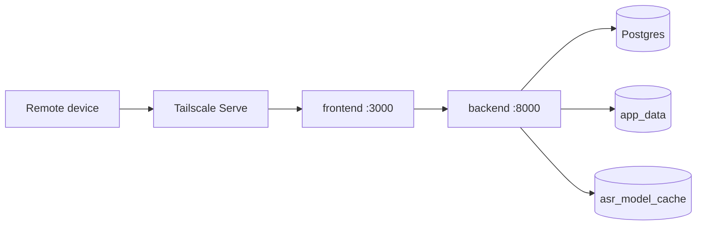
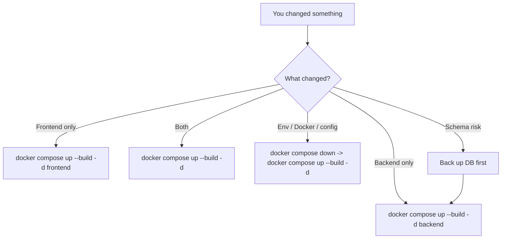
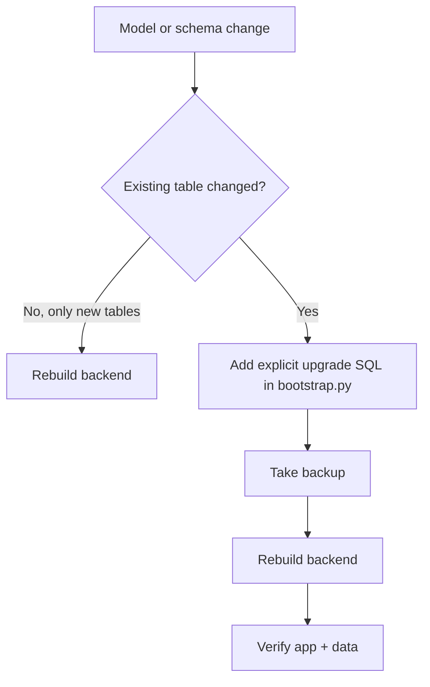

# Deploying trace_itself On A Lab Server

This guide assumes you want a private-first deployment on a lab machine that you can reach remotely without broadly exposing the app to the public internet.

For the full Tailscale setup tutorial, firewall guidance, verification steps, and troubleshooting, use [docs/tailscale.md](/home/jnln3799/every_on_git_ubuntu/trace_itself/docs/tailscale.md). This page focuses on the deployment flow for `trace_itself` itself.

## Deployment model

- `db` stays on the internal Docker network only.
- `backend` binds to `127.0.0.1:8000` on the host.
- `frontend` binds to `127.0.0.1:3000` on the host.
- Remote access is provided through Tailscale Serve so the app stays private to your tailnet.

### Deployment topology



## Prerequisites

- Docker Engine with the Compose plugin installed on the lab machine
- Tailscale installed on the lab machine
- A tailnet with HTTPS enabled
- A non-sensitive machine name if you plan to use the `https://...ts.net` URL publicly inside your tailnet

## Recommended environment settings

Start from:

```bash
cp .env.example .env
```

Then change these values:

- `POSTGRES_PASSWORD` to a strong database password
- `SECRET_KEY` to a long random secret
- `CREDENTIALS_SECRET_KEY` to a second long random secret for encrypting stored provider API keys
- `DEFAULT_LLM_RUNS_PER_24H` if you want a different default text budget
- `DEFAULT_MAX_AUDIO_SECONDS_PER_REQUEST` if you want a different default audio cap
- `INITIAL_ADMIN_USERNAME` to the first admin login name
- `INITIAL_ADMIN_PASSWORD` to the first admin password
- `AUTH_MAX_FAILED_ATTEMPTS` if you want a different lockout threshold
- `AUTH_LOCKOUT_MINUTES` if you want a different lockout duration
- `GEMINI_API_KEY` if you want Gemini pre-seeded as a meeting-note provider

Use these security settings:

- For local-only testing on the lab machine: `SESSION_COOKIE_SECURE=false`
- For real remote access over Tailscale HTTPS: `SESSION_COOKIE_SECURE=true`

Optional ASR tuning:

- `ASR_MODEL_NAME=SoybeanMilk/faster-whisper-Breeze-ASR-25` for the default local ASR model
- `ASR_DEVICE=cuda` for the NVIDIA lab-machine path
- `ASR_COMPUTE_TYPE=float16` for the default Breeze CUDA path
- `ASR_LIVE_PARTIAL_INTERVAL_MS=1500` for the live partial refresh cadence
- `ASR_LIVE_COMMIT_SILENCE_MS=1200` for the pause length that commits a live utterance
- `ASR_LIVE_MAX_WINDOW_SECONDS=18` for the rolling live decode window
- `ASR_MAX_UPLOAD_MB=512` for long compressed ASR uploads
- `MEETING_MAX_UPLOAD_MB=512` for long compressed meeting uploads
- `GEMINI_MODEL=gemini-3.1-flash-lite-preview` unless you intentionally pin a different Gemini release

After first login, use the `Control` page to:

- create more accounts
- assign feature access groups
- reset passwords or unlock locked users
- store ASR and LLM provider settings
- enable or disable providers for the user-facing selectors
- set the shared text/audio budget policy

## Start the app

If you want Breeze ASR to run on the local NVIDIA GPU, install the NVIDIA Container Toolkit on the Ubuntu host first:

```bash
curl -fsSL https://nvidia.github.io/libnvidia-container/gpgkey | \
  sudo gpg --dearmor -o /usr/share/keyrings/nvidia-container-toolkit-keyring.gpg
curl -fsSL https://nvidia.github.io/libnvidia-container/stable/deb/nvidia-container-toolkit.list | \
  sed 's#deb https://#deb [signed-by=/usr/share/keyrings/nvidia-container-toolkit-keyring.gpg] https://#g' | \
  sudo tee /etc/apt/sources.list.d/nvidia-container-toolkit.list > /dev/null
sudo apt-get update
sudo apt-get install -y nvidia-container-toolkit
sudo nvidia-ctk runtime configure --runtime=docker
sudo systemctl restart docker
```

If Docker still cannot see the GPU after that, the most useful quick checks are:

```bash
docker info --format '{{json .Runtimes}} {{json .DefaultRuntime}}'
docker run --rm --gpus all alpine:3.21 true
```

If the second command fails with `no known GPU vendor found`, Docker still is not wired to the NVIDIA runtime.

Recommended CUDA startup:

```bash
docker compose -f docker-compose.yml -f docker-compose.cuda.yml up --build -d
docker compose ps
```

Temporary CPU-only fallback:

```bash
docker compose up --build -d
docker compose ps
```

Local checks on the server:

```bash
curl http://127.0.0.1:8000/healthz
curl http://127.0.0.1:3000/
```

Useful CUDA check after the GPU stack is up:

```bash
docker compose exec backend python - <<'PY'
import ctranslate2
print("cuda_count", ctranslate2.get_cuda_device_count())
print("cuda_compute_types", ctranslate2.get_supported_compute_types("cuda"))
PY
```

Full end-to-end CUDA verification:

```bash
./scripts/verify_cuda_asr.sh
```

ASR notes:

- The first transcription request downloads the Breeze ASR model into the Docker volume `asr_model_cache`.
- The backend image now includes the CUDA user-space libraries faster-whisper expects for GPU inference.
- `docker-compose.cuda.yml` is the overlay that exposes the NVIDIA GPU to the backend container.
- The first live ASR chunk can also trigger that model warm-up, so the very first live response may be slower.
- That first ASR run can take longer than normal, depending on your network and chosen model.
- After the model is cached, later transcriptions are much faster.
- If CUDA is configured but unavailable, the backend stays up and the ASR endpoints return `503` with a clear fix message.
- The live ASR page streams mic audio in small normalized chunks and still stores a compact Opus/WebM recording when the take is saved.
- Saved audio files live in the Docker volume `app_data`, so they persist across container restarts.
- Meeting note generation requires `GEMINI_API_KEY`; without it, the `Meetings` page cannot complete note generation.
- Provider API secrets are stored encrypted in Postgres.
- The default policy is 3 LLM text runs per user per rolling 24 hours and 5 hours max audio per file.

## Private remote access with Tailscale Serve

1. Install and authenticate Tailscale on the lab machine.
2. In the Tailscale admin console, enable `MagicDNS` and `HTTPS` if they are not already enabled.
3. Bring the app up with Docker Compose.
4. Keep the app bound to localhost as configured in `docker-compose.yml`.
5. Publish the frontend privately to your tailnet:

   ```bash
   sudo tailscale serve --bg 3000
   ```

6. Confirm the published URL:

   ```bash
   tailscale serve status
   ```

7. Confirm that Funnel is not active:

   ```bash
   tailscale funnel status
   ```

8. Open the HTTPS URL shown by Tailscale from another device on your tailnet.

This gives you a private HTTPS entrypoint for the dashboard while keeping the underlying containers off the public internet.

Important:

- `tailscale serve` is private to your tailnet
- `tailscale funnel` is public internet exposure and should normally stay off for `trace_itself`
- if Funnel was accidentally enabled, disable it with `sudo tailscale funnel reset`

If you use `ufw`, keep the firewall rule on `tailscale0` and do not open `3000` or `8000` publicly. See [docs/tailscale.md](/home/jnln3799/every_on_git_ubuntu/trace_itself/docs/tailscale.md) for the exact commands.

## Day-2 operations

View logs:

```bash
docker compose logs -f backend
docker compose logs -f frontend
docker compose logs -f db
```

Important:

- `docker compose logs -f ...` only shows logs
- it does not rebuild images
- it does not restart containers

### What to restart when code changes



Frontend only:

```bash
docker compose up --build -d frontend
```

Backend only:

```bash
docker compose up --build -d backend
```

Use this after:

- FastAPI code changes
- ASR model or upload setting changes
- Gemini API key or model changes
- schema upgrade SQL changes

Frontend and backend together:

```bash
docker compose up --build -d
```

Restart without rebuilding:

```bash
docker compose restart frontend backend
```

Full reset of running containers without deleting data:

```bash
docker compose down
docker compose up --build -d
```

If the browser still shows the old frontend after a frontend deploy, do a hard refresh.

### Database and schema changes



This repo currently creates missing tables on backend startup and runs explicit schema upgrade SQL from [backend/app/db/bootstrap.py](/home/jnln3799/every_on_git_ubuntu/trace_itself/backend/app/db/bootstrap.py).

That means:

- model changes alone do not guarantee that an existing Postgres schema is fully migrated
- for schema changes on existing tables, add explicit migration logic first
- after adding that migration logic, rebuild the backend container

Rebuild backend after safe additive schema work:

```bash
docker compose up --build -d backend
```

If you are doing disposable local development and want a fresh database:

```bash
docker compose down -v
docker compose up --build -d
```

Warning: `docker compose down -v` deletes the Postgres volume and all saved data.

Before risky schema work on real data:

```bash
docker compose exec db sh -lc 'pg_dump -U "$POSTGRES_USER" "$POSTGRES_DB"' > trace_itself_backup.sql
```

### Update after pulling repo changes

```bash
git pull
docker compose up --build -d
docker compose ps
```

### Tailscale after app updates

Normally you do not need to re-run `tailscale serve --bg 3000` after rebuilding the app.

Recheck only if:

- Tailscale was restarted
- Serve was reset
- the frontend port changed

Verification:

```bash
tailscale serve status
tailscale funnel status
```

Stop the stack:

```bash
docker compose down
```

Stop Tailscale Serve:

```bash
sudo tailscale serve reset
```

Reset Tailscale Funnel if it was enabled by mistake:

```bash
sudo tailscale funnel reset
```

## Backup note

The Postgres data lives in the Docker volume `trace_itself_postgres_data`. For a basic logical backup:

```bash
docker compose exec db sh -lc 'pg_dump -U "$POSTGRES_USER" "$POSTGRES_DB"' > trace_itself_backup.sql
```

## Operational assumptions

- This MVP supports multiple users, but each user's data is private to their own account.
- User management is admin-led through the app.
- The app expects a trusted private network entrypoint rather than a public open-internet deployment.
- Tailscale is the recommended remote-access layer for this repository.
