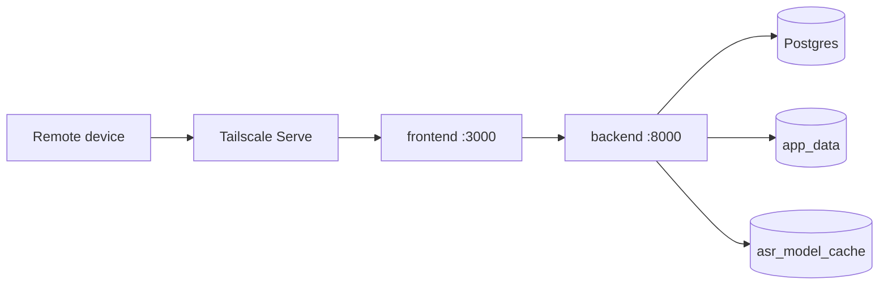
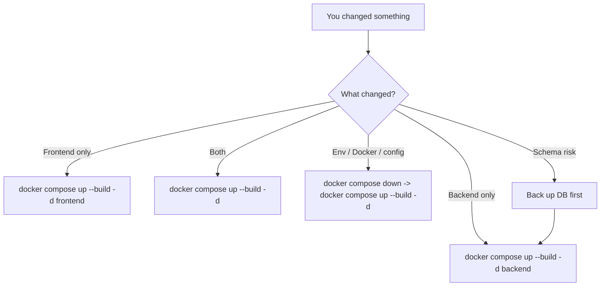
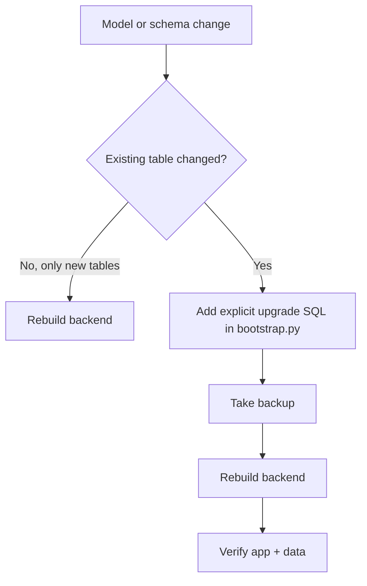

# Deploying trace_itself On A Lab Server

This guide assumes a private-first deployment on a lab machine that you can reach remotely without broadly exposing the app to the public internet.

Tailscale Serve remains the recommended path. Tailscale Funnel is supported as an explicit opt-in when you intentionally want public internet reachability for demos or limited external access.

For the full Tailscale setup tutorial, firewall guidance, verification steps, and troubleshooting, use [docs/tailscale.md](/home/jnln3799/every_on_git_ubuntu/trace_itself/docs/tailscale.md). This page focuses on the deployment flow for `trace_itself` itself.

## What you are deploying

You are not deploying a generic to-do app.

The deployed system includes:

- the mission-control dashboard
- execution intelligence endpoints for next actions, stagnation, reality gap, weekly review, activity feed, and timeline
- the project tracer surface for projects, milestones, tasks, and daily logs
- the optional audio workspace for local ASR and meeting notes

The command-center logic is computed inside the existing FastAPI backend. There is no separate worker tier or analytics service in the MVP, which keeps deployment and recovery simple.

## Deployment model

- `db` stays on the internal Docker network only.
- `backend` binds to `127.0.0.1:8000` on the host.
- `frontend` binds to `127.0.0.1:3000` on the host.
- Remote access is provided through Tailscale Serve so the app stays private to your tailnet by default.
- Public exposure can be added later with Tailscale Funnel without changing the container binding model.

### Deployment topology



## Prerequisites

- Docker Engine with the Compose plugin installed on the lab machine
- Tailscale installed on the lab machine
- A tailnet with HTTPS enabled
- A non-sensitive machine name if you plan to use the `https://...ts.net` URL either inside your tailnet or publicly through Funnel

## Recommended environment settings

Start from:

```bash
cp .env.example .env
```

Then change these values:

- `APP_ENV=production` for real deployments so the backend enforces production-only security checks
- `POSTGRES_PASSWORD` to a strong database password
- `SECRET_KEY` to a long random secret
- `CREDENTIALS_SECRET_KEY` to a second long random secret for encrypting stored provider API keys
- `DEFAULT_LLM_RUNS_PER_24H` if you want a different default text budget
- `DEFAULT_MAX_AUDIO_SECONDS_PER_REQUEST` if you want a different default audio cap
- `INITIAL_ADMIN_USERNAME` to the first admin login name
- `INITIAL_ADMIN_PASSWORD` to the first admin password
- `AUTH_MAX_FAILED_ATTEMPTS` if you want a different lockout threshold
- `AUTH_LOCKOUT_MINUTES` if you want a different lockout duration
- `GEMINI_API_KEY` if you want Gemini pre-seeded as a meeting-note provider

Use these security settings:

- For local-only testing on the lab machine: `SESSION_COOKIE_SECURE=false`
- For real remote access over Tailscale HTTPS, whether via Serve or Funnel: `SESSION_COOKIE_SECURE=true`
- Keep `SESSION_IDLE_TIMEOUT_MINUTES=5` unless you intentionally want a different backend-enforced idle timeout

If you plan to use Tailscale Funnel:

- `APP_ENV=production` should be treated as required
- `CREDENTIALS_SECRET_KEY` should be treated as required, not optional
- the login page becomes public even though self-serve signup is not live
- ordinary internet scanner traffic in the frontend logs is expected

The backend now refuses to start in production when any of these are still unsafe:

- `SECRET_KEY` is still a placeholder
- `INITIAL_ADMIN_PASSWORD` is still a placeholder
- `CREDENTIALS_SECRET_KEY` is missing or reuses `SECRET_KEY`
- `SESSION_COOKIE_SECURE=false`

Optional ASR tuning:

- `ASR_MODEL_NAME=SoybeanMilk/faster-whisper-Breeze-ASR-25` for the default local ASR model
- `ASR_DEVICE=cuda` for the NVIDIA lab-machine path
- `ASR_COMPUTE_TYPE=float16` for the default Breeze CUDA path
- `ASR_LIVE_PARTIAL_INTERVAL_MS=1500` for the live partial refresh cadence
- `ASR_LIVE_COMMIT_SILENCE_MS=1200` for the pause length that commits a live utterance
- `ASR_LIVE_MAX_WINDOW_SECONDS=18` for the rolling live decode window
- `ASR_LIVE_MAX_CHUNK_KB=2048` for the backend hard ceiling on accepted live audio chunk size
- `NEXT_PUBLIC_ASR_LIVE_TRANSPORT_TARGET_KB=32` for the browser-side upload granularity; this only changes transport batching and not ASR decoder context
- `NEXT_PUBLIC_ASR_LIVE_TRANSPORT_MAX_WAIT_MS=1000` for the browser-side max wait before flushing a smaller transport batch
- `ASR_LIVE_MAX_UTTERANCE_SECONDS=45` for the longest uninterrupted live utterance buffered before a forced commit
- `ASR_LIVE_MAX_SESSIONS_PER_USER=2` for the maximum number of non-finalized live ASR sessions per account
- `ASR_MAX_UPLOAD_MB=512` for long compressed ASR uploads
- `ASR_MEETING_DIARIZATION_ENABLED=true` to allow optional multi-speaker diarization on transcript uploads, meeting uploads, and saved live-take post-processing
- `ASR_MEETING_DIARIZER_MODEL=nvidia/diar_sortformer_4spk-v1` for the default NeMo Sortformer diarizer used by the saved-audio diarization path
- `ASR_MEETING_DIARIZATION_DEVICE=cuda` for GPU-backed diarization on the saved-audio path
- `ASR_MEETING_DIARIZATION_DEFAULT_MAX_SPEAKERS=3` for the default auto-detect speaker cap offered in transcript and notes forms, and the fallback cap used when saved live takes are diarized after stop
- `ASR_MEETING_DIARIZATION_MERGE_GAP_SECONDS=1.2` for how aggressively adjacent same-speaker phrases are merged into one transcript line
- `ASR_MEETING_DIARIZATION_GAP_TOLERANCE_SECONDS=0.4` for how far a transcript segment can be from a diarized speaker turn before speaker assignment falls back instead of forcing a label
- `ASR_MEETING_DIARIZATION_SHORT_TURN_SECONDS=1.6` for how short an isolated speaker flip must be before it is merged back into matching neighbors
- `ASR_MEETING_DIARIZATION_MIN_OVERLAP_SECONDS=0.35` for the maximum absolute overlap required before a speaker label is accepted from a turn match
- `ASR_MEETING_DIARIZATION_MIN_OVERLAP_RATIO=0.35` for the proportional overlap threshold used on shorter ASR segments before a speaker label is accepted
- `MEETING_MAX_UPLOAD_MB=512` for long compressed meeting uploads
- `GEMINI_MODEL=gemini-3.1-flash-lite-preview` unless you intentionally pin a different Gemini release

When tuning live ASR, keep these layers separate:

- transport/upload granularity: `NEXT_PUBLIC_ASR_LIVE_TRANSPORT_TARGET_KB`, `NEXT_PUBLIC_ASR_LIVE_TRANSPORT_MAX_WAIT_MS`
- rolling decoder context: `ASR_LIVE_MAX_WINDOW_SECONDS`
- utterance commit policy: `ASR_LIVE_COMMIT_SILENCE_MS`, `ASR_LIVE_MAX_UTTERANCE_SECONDS`

After first login, use the `Control` page to:

- create more accounts
- assign feature access groups
- reset passwords or unlock locked users
- store ASR and LLM provider settings
- enable or disable providers for the user-facing selectors
- set the shared text/audio budget policy

Security notes:

- password resets now revoke all existing sessions for that account
- the backend now enforces the idle timeout, not just the frontend
- Gemini provider URLs are restricted to the official Google API host instead of arbitrary outbound URLs

## Start the app

If you want Breeze ASR to run on the local NVIDIA GPU, install the NVIDIA Container Toolkit on the Ubuntu host first:

```bash
curl -fsSL https://nvidia.github.io/libnvidia-container/gpgkey | \
  sudo gpg --dearmor -o /usr/share/keyrings/nvidia-container-toolkit-keyring.gpg
curl -fsSL https://nvidia.github.io/libnvidia-container/stable/deb/nvidia-container-toolkit.list | \
  sed 's#deb https://#deb [signed-by=/usr/share/keyrings/nvidia-container-toolkit-keyring.gpg] https://#g' | \
  sudo tee /etc/apt/sources.list.d/nvidia-container-toolkit.list > /dev/null
sudo apt-get update
sudo apt-get install -y nvidia-container-toolkit
sudo nvidia-ctk runtime configure --runtime=docker
sudo systemctl restart docker
```

If Docker still cannot see the GPU after that, the most useful quick checks are:

```bash
docker info --format '{{json .Runtimes}} {{json .DefaultRuntime}}'
docker run --rm --gpus all alpine:3.21 true
```

If the second command fails with `no known GPU vendor found`, Docker still is not wired to the NVIDIA runtime.

Recommended startup on the NVIDIA lab machine:

```bash
docker compose up --build -d
docker compose ps
```

The main `docker-compose.yml` now requests the NVIDIA GPU for the backend by default. If you intentionally need CPU-only fallback, temporarily set:

```env
ASR_DEVICE=cpu
ASR_COMPUTE_TYPE=float32
```

Local checks on the server:

```bash
curl http://127.0.0.1:8000/healthz
curl http://127.0.0.1:3000/
```

Useful CUDA check after the GPU stack is up:

```bash
docker compose exec backend python - <<'PY'
import ctranslate2
print("cuda_count", ctranslate2.get_cuda_device_count())
print("cuda_compute_types", ctranslate2.get_supported_compute_types("cuda"))
PY
```

Full end-to-end CUDA verification:

```bash
./scripts/verify_cuda_asr.sh
```

ASR notes:

- The first transcription request downloads the Breeze ASR model into the Docker volume `asr_model_cache`.
- The backend image now includes the CUDA user-space libraries faster-whisper expects for GPU inference.
- The backend now also installs NeMo ASR dependencies so transcript uploads, meeting uploads, and saved live takes can run Sortformer diarization on the saved-audio path.
- The main `docker-compose.yml` now exposes the NVIDIA GPU to the backend container on the lab machine.
- `docker-compose.cuda.yml` is kept only as a backward-compatible overlay for older commands.
- The first live ASR chunk can also trigger that model warm-up, so the very first live response may be slower.
- That first ASR run can take longer than normal, depending on your network and chosen model.
- After the model is cached, later transcriptions are much faster.
- If CUDA is configured but unavailable, the backend stays up and the ASR endpoints return `503` with a clear fix message.
- Live ASR now rejects oversized chunks, limits open sessions per user, and force-commits long uninterrupted utterances to keep memory bounded.
- The live ASR page streams mic audio in small normalized chunks, keeps recording alive while users browse other in-app pages, and still stores a compact Opus/WebM recording when the take is saved.
- Transport batching is now separate from recognition context: the browser can upload around `32 KB` at a time while the backend still keeps its own rolling decoder window and utterance-commit logic.
- The recorder now lives at the authenticated app-shell level instead of only inside the `Audio` page, and other pages expose a compact live dock so users can stop, save, or jump back to `Audio` without losing the session.
- The open-session limit now counts only non-finalized sessions, and obviously orphaned pre-start sessions are reaped automatically so one visible recorder does not trip a false multi-session error.
- Saved audio passed to the diarizer is normalized to mono `16 kHz` WAV with `ffmpeg` before NeMo runs, which keeps browser-recorded WebM uploads compatible with the Sortformer path.
- Saved audio files live in the Docker volume `app_data`, so they persist across container restarts.
- Live ASR sessions are held in backend memory, so after deploying a session-lifecycle fix it is reasonable to restart the backend once and clear any stale sessions from the old runtime.
- Cross-page persistence only applies to in-app navigation. A full page refresh or closing the tab still interrupts browser microphone capture, so this should be described to users as navigation-safe rather than reload-safe.
- Meeting note generation requires `GEMINI_API_KEY`; without it, the `Meetings` page cannot complete note generation.
- Multi-speaker diarization is opt-in from the `Transcript` file-upload form and the `Notes` form. Saved live takes also attempt diarization by default after stop/save, but true real-time live diarization is not part of the streaming path yet.
- If a live save falls back to transcript-only persistence because replay audio could not be attached, the transcript is still kept, but there is no audio file left for the post-save diarization pass.
- Provider API secrets are stored encrypted in Postgres, and production deployments must now use a dedicated `CREDENTIALS_SECRET_KEY`.
- The default policy is 3 LLM text runs per user per rolling 24 hours and 5 hours max audio per file.

## Private remote access with Tailscale Serve

1. Install and authenticate Tailscale on the lab machine.
2. In the Tailscale admin console, enable `MagicDNS` and `HTTPS` if they are not already enabled.
3. Bring the app up with Docker Compose.
4. Keep the app bound to localhost as configured in `docker-compose.yml`.
5. Publish the frontend privately to your tailnet:

   ```bash
   sudo tailscale serve --bg 3000
   ```

6. Confirm the published URL:

   ```bash
   tailscale serve status
   ```

7. Confirm that Funnel is not active:

   ```bash
   tailscale funnel status
   ```

8. Open the HTTPS URL shown by Tailscale from another device on your tailnet.

This gives you a private HTTPS entrypoint for the dashboard while keeping the underlying containers off the public internet.

Important:

- `tailscale serve` is private to your tailnet
- `tailscale funnel` is public internet exposure and should normally stay off for `trace_itself`
- if Funnel was accidentally enabled, disable it with `sudo tailscale funnel reset`

If you use `ufw`, keep the firewall rule on `tailscale0` and do not open `3000` or `8000` publicly. See [docs/tailscale.md](/home/jnln3799/every_on_git_ubuntu/trace_itself/docs/tailscale.md) for the exact commands.

## Optional public exposure with Tailscale Funnel

Use this only when you intentionally want the frontend reachable from the public internet.

1. Confirm the production settings are in place:

   ```env
   APP_ENV=production
   SESSION_COOKIE_SECURE=true
   CREDENTIALS_SECRET_KEY=<dedicated-strong-secret>
   ```

2. Keep the containers bound to localhost as they are now. Do not expose `3000` or `8000` with router forwarding or firewall allow rules.
3. Publish only the frontend:

   ```bash
   sudo tailscale funnel --bg 3000
   tailscale funnel status
   ```

4. Open the `https://...ts.net` URL shown by `tailscale funnel status`.

Important Funnel warnings:

- the login page is public internet reachable
- Funnel traffic does not carry the Tailscale identity headers that Serve can add for tailnet traffic
- internet scanner traffic is normal and should be expected in your logs
- the current auth model is still issued-account based, not self-serve public signup
- the backend should remain private on `127.0.0.1:8000`

If you want to switch back to private-only access:

```bash
sudo tailscale funnel reset
sudo tailscale serve --bg 3000
```

## Day-2 operations

View logs:

```bash
docker compose logs -f backend
docker compose logs -f frontend
docker compose logs -f db
```

Important:

- `docker compose logs -f ...` only shows logs
- it does not rebuild images
- it does not restart containers

### What to restart when code changes



Frontend only:

```bash
docker compose up --build -d frontend
```

Backend only:

```bash
docker compose up --build -d backend
```

Use this after:

- FastAPI code changes
- ASR model or upload setting changes
- Gemini API key or model changes
- schema upgrade SQL changes

Frontend and backend together:

```bash
docker compose up --build -d
```

Restart without rebuilding:

```bash
docker compose restart frontend backend
```

Full reset of running containers without deleting data:

```bash
docker compose down
docker compose up --build -d
```

If the browser still shows the old frontend after a frontend deploy, do a hard refresh.

### Database and schema changes



This repo currently creates missing tables on backend startup and runs explicit schema upgrade SQL from [backend/app/db/bootstrap.py](/home/jnln3799/every_on_git_ubuntu/trace_itself/backend/app/db/bootstrap.py).

That means:

- model changes alone do not guarantee that an existing Postgres schema is fully migrated
- for schema changes on existing tables, add explicit migration logic first
- after adding that migration logic, rebuild the backend container

Rebuild backend after safe additive schema work:

```bash
docker compose up --build -d backend
```

If you are doing disposable local development and want a fresh database:

```bash
docker compose down -v
docker compose up --build -d
```

Warning: `docker compose down -v` deletes the Postgres volume and all saved data.

Before risky schema work on real data:

```bash
docker compose exec db sh -lc 'pg_dump -U "$POSTGRES_USER" "$POSTGRES_DB"' > trace_itself_backup.sql
```

### Update after pulling repo changes

```bash
git pull
docker compose up --build -d
docker compose ps
```

### Tailscale after app updates

Normally you do not need to re-run `tailscale serve --bg 3000` or `tailscale funnel --bg 3000` after rebuilding the app.

Recheck only if:

- Tailscale was restarted
- Serve was reset
- Funnel was reset
- the frontend port changed

Verification:

```bash
tailscale serve status
tailscale funnel status
```

Stop the stack:

```bash
docker compose down
```

Stop Tailscale Serve:

```bash
sudo tailscale serve reset
```

Reset Tailscale Funnel if it was enabled by mistake:

```bash
sudo tailscale funnel reset
```

## Backup note

The Postgres data lives in the Docker volume `trace_itself_postgres_data`. For a basic logical backup:

```bash
docker compose exec db sh -lc 'pg_dump -U "$POSTGRES_USER" "$POSTGRES_DB"' > trace_itself_backup.sql
```

## Operational assumptions

- This MVP supports multiple users, but each user's data is private to their own account.
- User management is admin-led through the app.
- The app is private-first and works best behind a trusted network boundary.
- Tailscale is the recommended remote-access layer for this repository.
- Public open-internet exposure is supported only as an explicit Tailscale Funnel opt-in.
