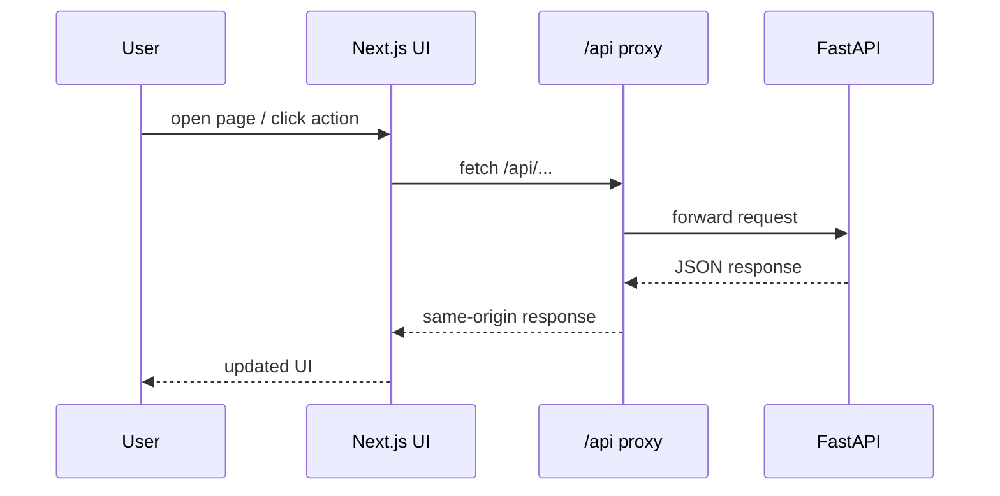

# trace_itself frontend

This is the Next.js App Router frontend for the trace_itself MVP.

It now supports username/password sign-in, an admin-only Users page, and lightweight progress visuals on the dashboard and project detail views.

## Frontend map

```mermaid
flowchart TB
    APP[Next.js App Router frontend]
    APP --> ROUTES[app routes]
    APP --> FEATURES[feature pages]
    APP --> COMPONENTS[shared components]
    APP --> LIB[API + helpers]
    APP --> STATE[auth state]

    ROUTES --> LOGIN[/login]
    ROUTES --> DASH[/]
    ROUTES --> ASR[/asr]
    ROUTES --> MEET[/meetings]
    ROUTES --> USERS[/users]
```

## Development

```bash
cd frontend
npm install
npm run dev
```

The dev server proxies `/api` to `API_PROXY_TARGET`. By default this is `http://127.0.0.1:8000`, and you can override it in `frontend/.env.local`.

### Request flow



## Production

The included `Dockerfile` builds the Next.js app in standalone mode and runs it as a small Node server. In Docker Compose, `/api` is proxied to the backend service during the frontend build and runtime.

## Notes

The app assumes cookie-based auth and a same-origin `/api` prefix so it can sit behind a private reverse proxy or VPN-style deployment.
