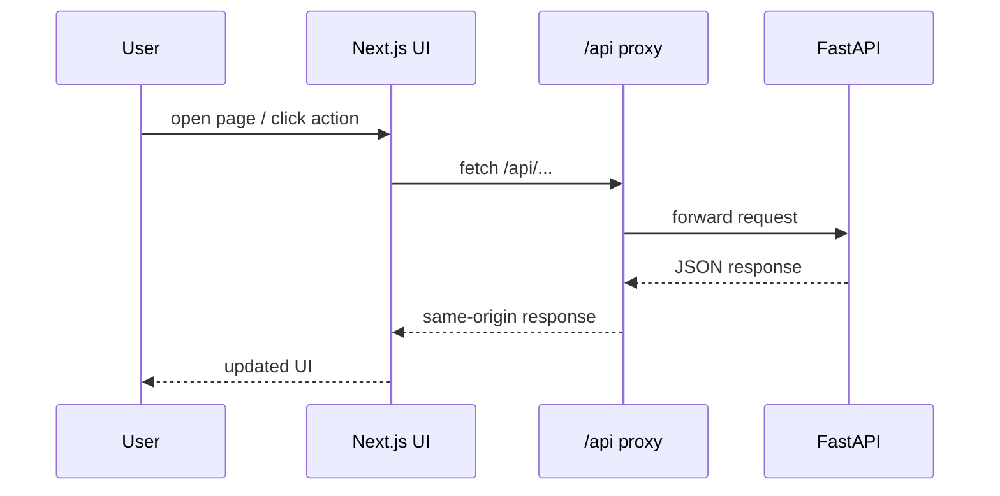

# trace_itself frontend

This is the Next.js App Router frontend for the trace_itself MVP.

It now supports username/password sign-in, an admin-only Users page, lightweight progress visuals on the dashboard and project detail views, and the `Audio` workspace with `Transcript` and `Notes` flows.

## Frontend map

```mermaid
flowchart TB
    APP[Next.js App Router frontend]
    APP --> ROUTES[app routes]
    APP --> FEATURES[feature pages]
    APP --> COMPONENTS[shared components]
    APP --> LIB[API + helpers]
    APP --> STATE[auth state]

    ROUTES --> LOGIN[/login]
    ROUTES --> DASH[/]
    ROUTES --> ASR[/asr]
    ROUTES --> MEET[/meetings]
    ROUTES --> USERS[/users]
```

## Development

```bash
cd frontend
npm install
npm run dev
```

The dev server proxies `/api` to `API_PROXY_TARGET`. By default this is `http://127.0.0.1:8000`, and you can override it in `frontend/.env.local`.

### Request flow



## Production

The included `Dockerfile` builds the Next.js app in standalone mode and runs it as a small Node server. In Docker Compose, `/api` is proxied to the backend service during the frontend build and runtime.

## Notes

The app assumes cookie-based auth and a same-origin `/api` prefix so it can sit behind a private reverse proxy or VPN-style deployment.

Audio-workspace behavior to keep in mind:

- transcript file uploads can opt into multi-speaker diarization
- meeting-note uploads can opt into multi-speaker diarization and still generate summaries/minutes/action items
- live ASR remains speaker-blind while recording, but saved live takes now save the transcript immediately and then try post-stop diarization in the background after replay audio is uploaded successfully
- live recognition uses the browser worklet's normalized mono `16 kHz` PCM stream, so transport batch size and saved replay bitrate are separate concerns
- the browser currently targets about `32 KB` PCM uploads with a short max-wait guard so weaker connections are less likely to turn queue growth into oversized requests
- saved live replay audio is recorded at about `64 kbps` to keep stop/save uploads smaller without materially changing the live ASR path itself
- the Next.js `/api` proxy now allows larger request bodies by default so long live replay uploads are not clipped around the old `10 MB` limit before they reach FastAPI
- the transcript UI now shows replay-processing status for saved live takes while background speaker-tag refinement is still running
- true real-time live diarization is not part of the current stream path
